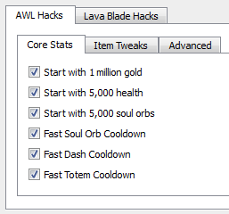
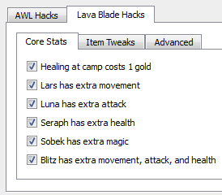

# Ragatron

"*It is like Game Genie for Lost Decade Games!*" - Matt Hackett, co-founder of Lost Decade Games.

Ragatron is a Windows-only (for now) open source hacking tool for HTML5 games developed by [Lost Decade Games](http://www.lostdecadegames.com). It specifically targets [A Wizard's Lizard](http://www.wizardslizard.com) and [Lava Blade](http://www.lavablade.com).

This project is not officially supported by Lost Decade Games. However, ** *you* ** can officially support Lost Decade Games by purchasing (multiple!) copies of their games to hack with this tool! ;-)

## Download

Ragatron can be downloaded at  [Ragatron.com](http://ragatron.com/)

## Hacks for A Wizard's Lizard
The only supported build is Humble Bundle version **2015-02-05**

- Start with 1 million gold
- Start with 5,000 health
- Start with 5,000 soul orbs
- Fast Soul Orb Cooldown
- Fast Dash Cooldown
- Fast Totem Cooldown
- Fast Skyrocket
- Fast Quad Spear
- Expose Developer Tools

## Hacks for Lava Blade
The only supported build is the version on Humble Bundle.

- Healing at camp costs 1 gold
- Lars has extra movement
- Luna has extra attack
- Seraph has extra health
- Sobek has extra magic
- Blitz has extra movement, attack, and health
- Earn more gold
- Expose Developer Tools

### Instructions

Make your media edits in the generated work directory. DO NOT MOVE ANY FILES! Instead, directly edit the original files.  All the super-critical files have been secured.

If you would like to cheat in the game, those are available through the Ragatron interface. It will drop in your cheats at the last minute from its own secure copy of the game.

If you mess something up, just click "Unpack" again to undo your changes. Ragatron does not modify any original files.

### Dependencies

- [Qt 5.4](http://www.qt.io/) SDK. The tested versions are compiled using MinGW bundled with Qt.

- [QuaZIP](http://quazip.sourceforge.net/) is licensed LGPL v2 and now statically built from within the project. There is no need to download this library.

### Todo

- Finish Mac support. It currently just launches. It does nothing useful.
- Expand to support other games
- Auto-detect the HTML5 binary joins (currently hard-coded).
- More cheats!
- Mod export/import support

### License

GPL v2 or later

###Author
&copy; 2015 Dan Nagle -  [@NagleCode](http://twitter.com/NagleCode) - [DanNagle.com](http://DanNagle.com)
