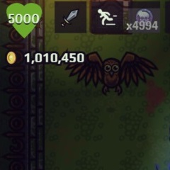
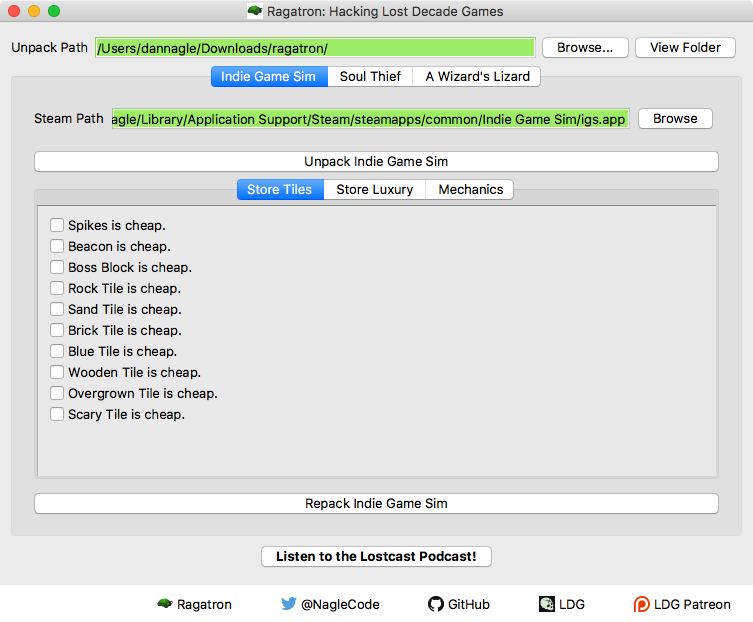

# Ragatron

Ragatron is an open source hacking tool for HTML5 games. It targets [A Wizard's Lizard](http://www.wizardslizard.com), [Indie Game Sim](http://www.indiegamesim.com), and [Soul Thief](http://www.wizardslizard.com) developed by [Lost Decade Games](http://www.lostdecadegames.com). It is available for Windows and (Intel-based) Mac. The only targeted versions are the currently shipping versions purchased from Steam.



Ragatron is not officially supported by Lost Decade Games. However, *you* can officially support indie game developers by purchasing (multiple!) copies of their games to hack with this tool! ;-)

** Note that using this tool violates Steam's ToS! **

## Download

Ragatron can be downloaded at  [Ragatron.com](http://ragatron.com/)




## Built-in Hacks for A Wizard's Lizard

- Start with 1 million gold
- Start with 5,000 health
- Start with 5,000 soul orbs
- Fast Soul Orb Cooldown
- Fast Dash Cooldown
- Fast Totem Cooldown
- Various Item Tweaks
- Raga start with various items


## Built-in Hacks for Indie Game Sim
- All the items in the store are cheaper
- Publishing games is cheaper


## Built-in Hacks for Soul Thief
Since this is early access, breaking changes are frequent.

- Start with 15 hearts
- Start with 1 million gold
- Start 1000 small keys
- Start with 1000 big keys
- 10,000 bonus prize tickets
- Super Strong Melee
- Start with gear
- Show Div Containers


### Instructions


Make your media edits in the generated work directory. DO NOT MOVE ANY FILES! Instead, directly edit the original files.  All the super-critical files have been secured.

If you would like to cheat in the game, those are available through the Ragatron interface. It will drop in your cheats at the last minute from its own secure copy of the game. If you mess something up, just click "Unpack" again to undo your changes. Ragatron does not modify any original files.


### Dependencies

- [Qt 5.6](http://www.qt.io/) SDK. The tested versions are compiled using MinGW bundled with Qt.

- QuaZIP has been removed. It is not needed for these games.

### Expanding the Cheats

Ragatron scans its run-time directory for `*.xml` files. If it doesn't find any, it will load in its internal xml files. Take a look at `wizardlizard.xml` under `ragatron/cheats` inside this project for guidance to add your own.


Example hack from the Wizard Lizard XML:
```
    <hack>
        <category>Core Stats</category>
        <platform>all</platform>
        <id>fastDashCheck</id>
        <name>Fast Dash Cooldown</name>
        <target>index.html</target>
        <search>dashCooldown:5e3</search>
        <replace>dashCooldown:500</replace>
    </hack>
```

Explanation:

 * category = The tab where the hack gets displayed.
 * id = An internal ID string. Must be unique.
 * name = The text to display to the user
 * target = the game file to hack.
 * search = the text to search
 * replace = the text to replace it with


### Todo
- Expand to support more games
- This project is currently accepting pull requests of XML expansions.  


### License

GPL v2 or later


### Author
&copy; 2017 Dan Nagle -  [@NagleCode](http://twitter.com/NagleCode) - [DanNagle.com](http://DanNagle.com)
