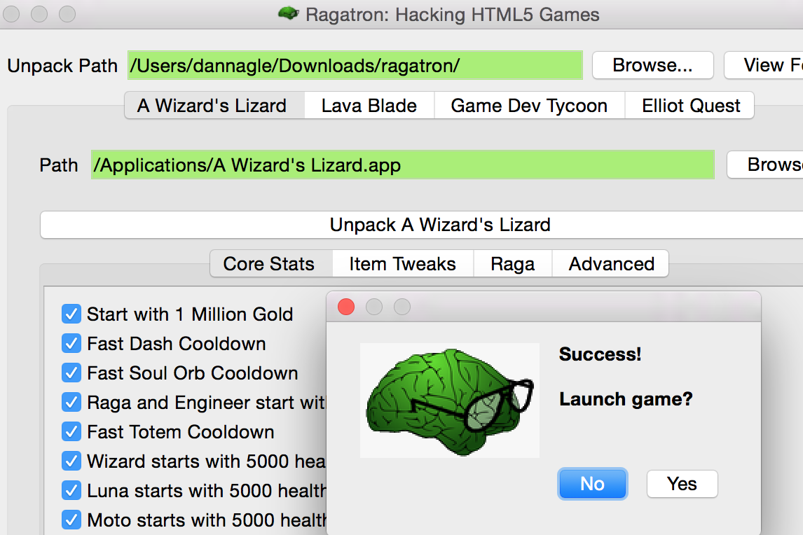

# Ragatron

"*It is like Game Genie for Lost Decade Games!*" - Matt Hackett, co-founder of Lost Decade Games.

Ragatron is an open source hacking tool for HTML5 games. It targets [A Wizard's Lizard](http://www.wizardslizard.com) and [Lava Blade](http://www.lavablade.com) developed by [Lost Decade Games](http://www.lostdecadegames.com). It also targets [Game Dev Tycoon](http://www.greenheartgames.com/app/game-dev-tycoon/) by [Greenheart Games](http://www.greenheartgames.com) . It is available for Windows and (Intel-based) Mac.

 


This project is not officially supported by Lost Decade Games nor Greenheart Games. However, *you* can officially support indie game developers by purchasing (multiple!) copies of their games to hack with this tool! ;-)


## Download

Ragatron can be downloaded at  [Ragatron.com](http://ragatron.com/)




## Built-in Hacks for Game Dev Tycoon
The only supported build is Humble Bundle version 2014-09-17

- Contracts pay 100x
- Research Points grow much faster
- Large G3 Booth is cheap
- Code Incomplete is Awesome!


## Built-in Hacks for A Wizard's Lizard
The only supported build is Humble Bundle version 2015-02-05


- Start with 1 million gold
- Start with 5,000 health
- Start with 5,000 soul orbs
- Fast Soul Orb Cooldown
- Fast Dash Cooldown
- Fast Totem Cooldown
- Various Item Tweaks
- Raga start with various items


## Built-in Hacks for Lava Blade
The only supported build is the version on Humble Bundle.

- Healing at camp costs 1 gold
- Lars has extra movement
- Luna has extra attack
- Seraph has extra health
- Sobek has extra magic
- Blitz has extra movement, attack, and health
- Earn more gold
- Expose Developer Tools

### Instructions


Make your media edits in the generated work directory. DO NOT MOVE ANY FILES! Instead, directly edit the original files.  All the super-critical files have been secured.

If you would like to cheat in the game, those are available through the Ragatron interface. It will drop in your cheats at the last minute from its own secure copy of the game. If you mess something up, just click "Unpack" again to undo your changes. Ragatron does not modify any original files.


### Dependencies

- [Qt 5.4](http://www.qt.io/) SDK. The tested versions are compiled using MinGW bundled with Qt.

- [QuaZIP](http://quazip.sourceforge.net/) is licensed LGPL v2 and is now statically built from within the project. There is no need to download.

### Expanding the Cheats

Ragatron scans its run-time directory for `*.xml` files. If it doesn't find any, it will load in its internal xml files. Take a look at `wizardlizard.xml` and `lavablade.xml` under `ragatron/cheats` inside this project for guidance to add your own.


Example hack from the Wizard Lizard XML:
```
    <hack>
        <category>Core Stats</category>
        <platform>all</platform>
        <id>fastDashCheck</id>
        <name>Fast Dash Cooldown</name>
        <target>index.html</target>
        <search>dashCooldown:5e3</search>
        <replace>dashCooldown:500</replace>
    </hack>
```

Explanation:

 * category = The tab where the hack gets displayed.
 * id = An internal ID string. Must be unique.
 * name = The text to display to the user
 * target = the game file to hack.
 * search = the text to search
 * replace = the text to replace it with


### Todo

- Expand to support more games
- Auto-detect the HTML5 binary joins (currently hard-coded).
- This project is currently accepting pull requests of XML expansions.  


### License

GPL v2 or later


### Author
&copy; 2015 Dan Nagle -  [@NagleCode](http://twitter.com/NagleCode) - [DanNagle.com](http://DanNagle.com)
